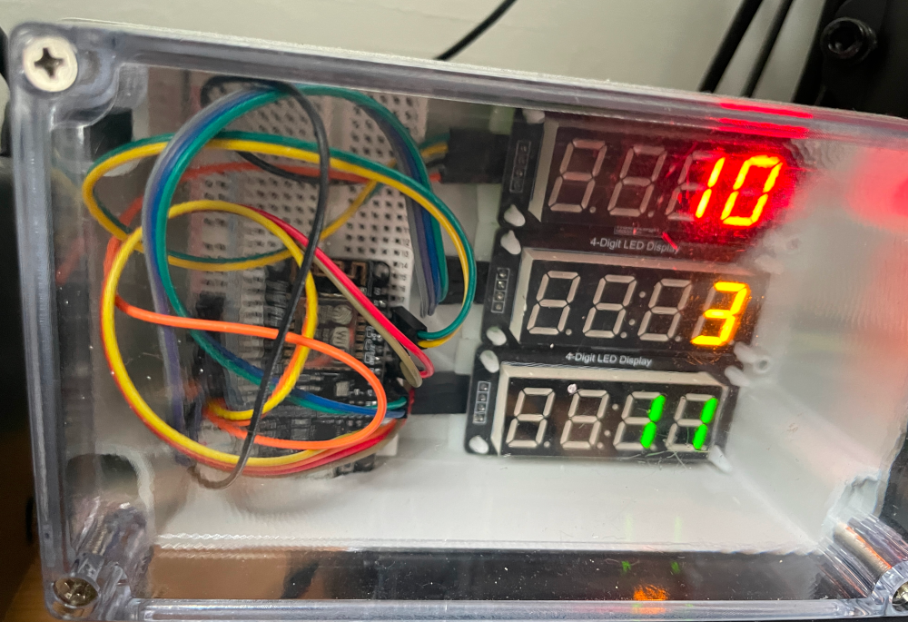

# netmeter8266

A network latency and bandwidth monitor for the ESP8266 and three TM1637 displays

## Things to note when trying to run this application

- I've only tested this in my house, on my network, in my office.  If your particular configuration causes your ESP8266 to explode/become radioactive/turn your house into a black hole, well, them's the breaks.
- You'll need to copy `netmeter.h.template` to `netmeter.h` and change the values within to match those for your own network.
- Pay attention to the pinout definitions in the `TM1637DisplayAlnum` definitions when wiring things up.
- The code *should* find the interface on your router by iterating through the appropriate SNMP table as long as you've set `snmp_community` correctly, and your router is configured to answer an SNMP request.
- This application will swear at you via the seven-segment displays when things go wrong.  If you don't like swearing, you should edit the `msg_` variables before running it.
- Yes, I know my wiring is a mess.  No, I'm not fixing it.
